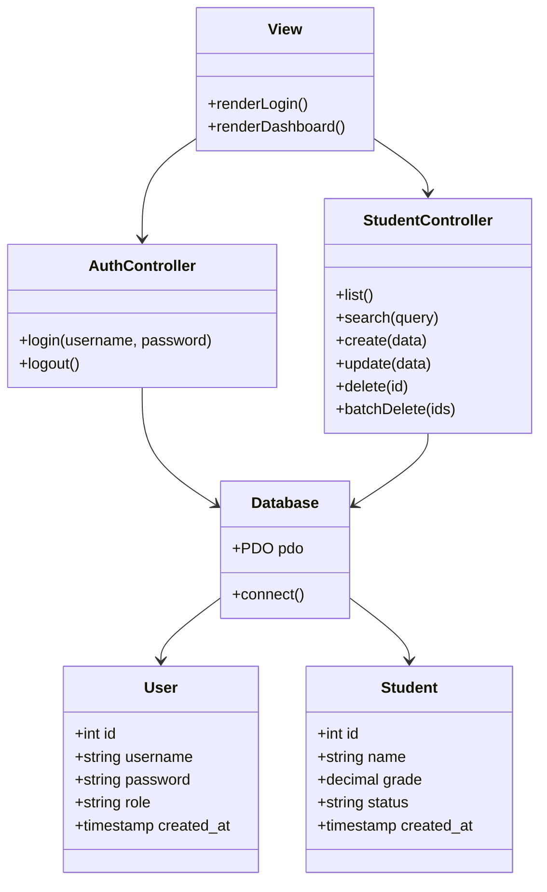
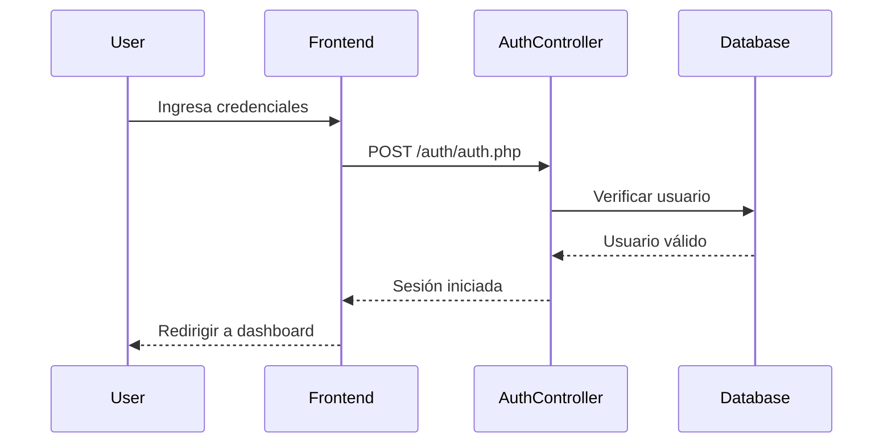
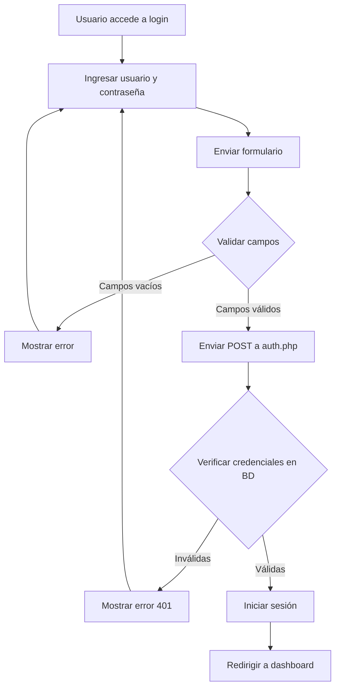
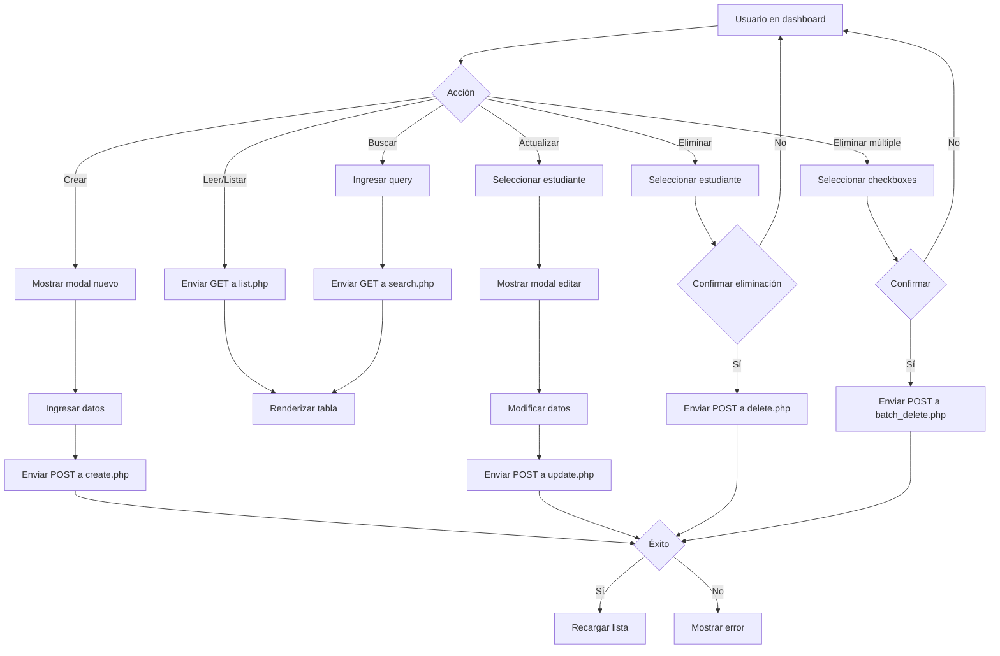
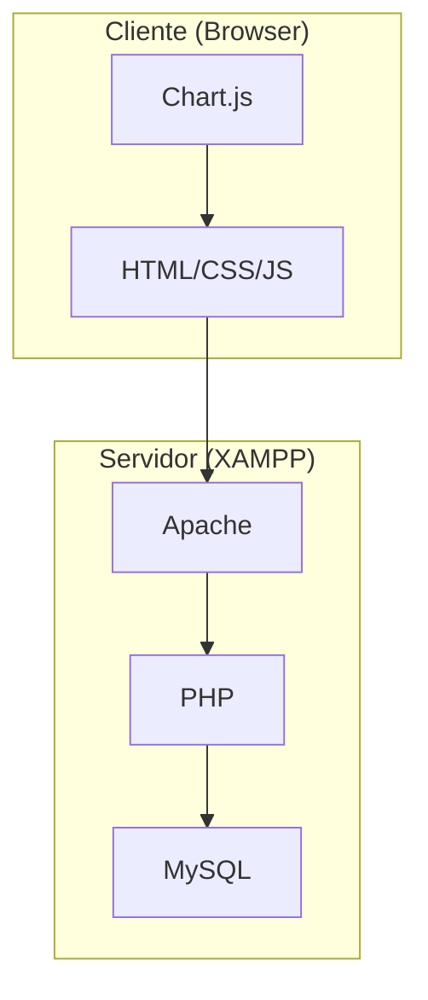
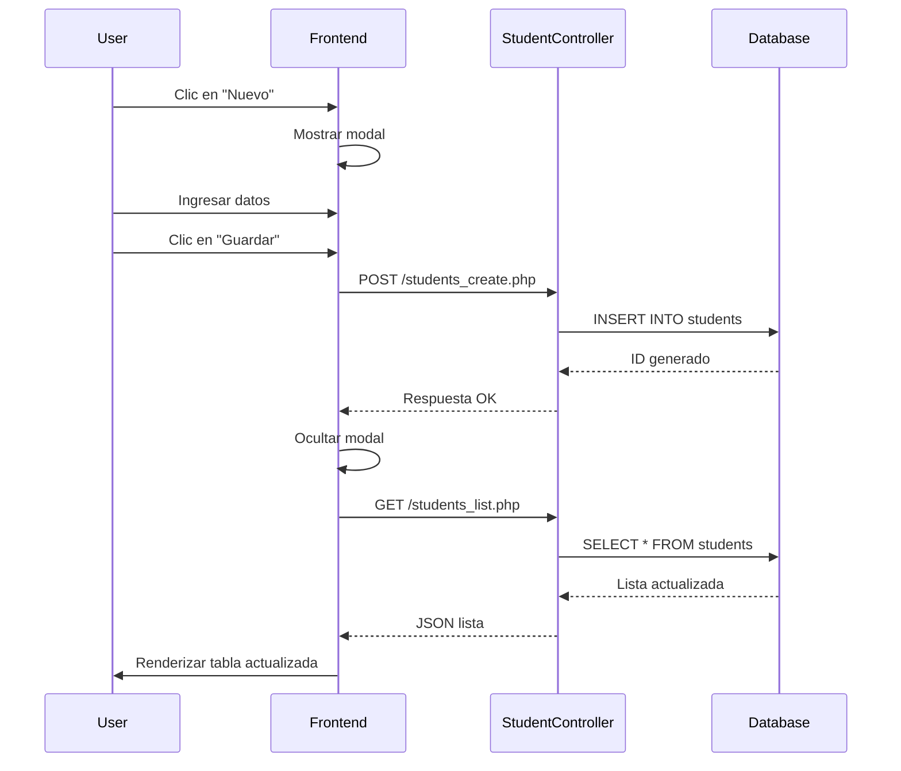

# Quiz Management System

## Descripción

Este proyecto es un sistema de gestión de estudiantes para quizzes, desarrollado con una arquitectura MVC (Modelo-Vista-Controlador). Permite a los administradores gestionar estudiantes, incluyendo operaciones CRUD (Crear, Leer, Actualizar, Eliminar), búsqueda, y visualización de estadísticas. Incluye autenticación básica y un frontend responsivo.

## Arquitectura MVC

El proyecto sigue el patrón de diseño Modelo-Vista-Controlador (MVC):

- **Modelo**: Maneja la lógica de datos y la interacción con la base de datos MySQL.
- **Vista**: Interfaz de usuario construida con HTML, CSS y JavaScript (Chart.js para gráficos).
- **Controlador**: Endpoints PHP que manejan las solicitudes HTTP y coordinan entre modelo y vista.

### Diagrama UML de Clases



### Diagrama de Secuencia (Login)



## Diagramas Adicionales

### Diagrama de Flujo del Proceso de Login



### Diagrama de Flujo para Operaciones CRUD de Estudiantes



### Diagrama de Componentes del Sistema



### Diagrama de Despliegue

```mermaid
deployment
    subgraph "Usuario"
        U[Browser]
    end
    subgraph "Servidor Local"
        S[XAMPP]
        S --> A[Apache Web Server]
        S --> P[PHP Interpreter]
        S --> M[MySQL Database]
    end
    U --> A
    A --> P
    P --> M
```

### Diagrama de Secuencia para Crear Estudiante



### Diagrama UML de Paquetes

```mermaid
classDiagram
    namespace Frontend {
        class index.html
        class page/index.html
        class assets/css/styles.css
        class assets/js/app.js
    }
    namespace Backend {
        namespace Auth {
            class auth.php
            class logout.php
        }
        namespace DB {
            class db.php
            class init_db.php
        }
        namespace Students {
            class students_list.php
            class students_create.php
            class students_update.php
            class students_delete.php
            class students_search.php
            class students_batch_delete.php
        }
    }
    namespace Database {
        class code.sql
        class students
        class users
    }
    Frontend --> Backend
    Backend --> Database
```

## Tecnologías Utilizadas

- **Backend**: PHP 8.0 con PDO para MySQL
- **Frontend**: HTML5, CSS3, JavaScript (ES6+)
- **Base de Datos**: MySQL 10.4 (MariaDB)
- **Librerías**: Chart.js para gráficos
- **Servidor**: XAMPP (Apache, MySQL, PHP)
- **Autenticación**: Sesiones PHP con contraseñas hasheadas (bcrypt)

## Instalación

1. **Requisitos**:
   - XAMPP instalado y corriendo (Apache y MySQL).
   - PHP 8.0+.
   - MySQL 5.7+.

2. **Configuración de la Base de Datos**:
   - Crear una base de datos llamada `code`.
   - Ejecutar el script `server/code.sql` para crear las tablas y datos iniciales.

3. **Configuración del Proyecto**:
   - Clonar o copiar el proyecto en `c:\xampp\htdocs\quiz`.
   - Asegurarse de que los permisos de archivos permitan ejecución de PHP.

4. **Ejecución**:
   - Iniciar XAMPP.
   - Acceder a `http://localhost/quiz/frontend/` en el navegador.

## Uso

1. **Login**: Usar credenciales de demo (usuario: admin, contraseña: adminpass) o crear un usuario en la BD.
2. **Dashboard**: Ver lista de estudiantes, buscar, agregar, editar, eliminar.
3. **Estadísticas**: Ver total de estudiantes, promedio de notas, y gráfico de barras.

### Screenshots

- **Pantalla de Login**: Muestra el formulario de inicio de sesión con logo y campos para usuario y contraseña.
- **Dashboard**: Tabla de estudiantes con opciones de búsqueda, botones para CRUD, estadísticas y gráfico de notas.
- **Modal de Edición**: Formulario modal para crear o editar estudiantes.

*(Nota: Para incluir screenshots reales, capturar pantallas del navegador y guardar en `frontend/assets/screenshots/` o similar, luego enlazar aquí.)*

## Código Clave

### Conexión a Base de Datos (`server/db/db.php`)

```php
<?php
$host = '127.0.0.1';
$user = 'root';
$pass = '';
$db = 'code';
$charset = 'utf8mb4';
$dsn = "mysql:host=$host;dbname=$db;charset=$charset";
$options = [
    PDO::ATTR_ERRMODE => PDO::ERRMODE_EXCEPTION,
    PDO::ATTR_DEFAULT_FETCH_MODE => PDO::FETCH_ASSOC,
];
try {
    $pdo = new PDO($dsn, $user, $pass, $options);
} catch (PDOException $e) {
    die(json_encode(['error' => 'DB connection failed: ' . $e->getMessage()]));
}
?>
```

### Autenticación (`server/auth/auth.php`)

```php
<?php
session_start();
header('Content-Type: application/json');
require_once __DIR__ . '/db.php';
$method = $_SERVER['REQUEST_METHOD'];
if ($method === 'POST') {
    $input = json_decode(file_get_contents('php://input'), true);
    $username = $input['username'] ?? '';
    $password = $input['password'] ?? '';
    if (!$username || !$password) {
        http_response_code(400);
        echo json_encode(['error' => 'username and password required']);
        exit;
    }
    $stmt = $pdo->prepare('SELECT * FROM users WHERE username = ? LIMIT 1');
    $stmt->execute([$username]);
    $user = $stmt->fetch();
    if ($user && password_verify($password, $user['password'])) {
        $_SESSION['user'] = $user['username'];
        $_SESSION['role'] = $user['role'];
        echo json_encode(['message' => 'ok', 'role' => $user['role']]);
        exit;
    } else {
        http_response_code(401);
        echo json_encode(['error' => 'invalid credentials']);
        exit;
    }
}
http_response_code(405);
echo json_encode(['error' => 'method not allowed']);
?>
```

### Frontend JavaScript (`frontend/assets/js/app.js`) - Parte de Carga y Renderizado

```javascript
async function load(query = "") {
    const q = query.trim();
    const endpoint = q ? `${URLS.search}?q=${encodeURIComponent(q)}` : URLS.list;
    const data = await fetchJson(endpoint);
    currentList = Array.isArray(data) ? data : [];
    render(currentList);
}

function render(list) {
    tbody.innerHTML = "";
    list.forEach((s) => {
        const tr = document.createElement("tr");
        tr.innerHTML = `
            <td><input type="checkbox" class="sel" data-id="${s.id}"></td>
            <td>${s.id}</td>
            <td>${s.name}</td>
            <td>${s.grade ?? ""}</td>
            <td>${s.status ?? ""}</td>
            <td>
                <button class="btn ghost edit" data-id="${s.id}">Editar</button>
                <button class="btn ghost delete" data-id="${s.id}">Eliminar</button>
            </td>`;
        tbody.appendChild(tr);
    });
    // ... estadísticas y gráfico
}
```

## Análisis de Decisiones Técnicas

- **Arquitectura MVC**: Elegida para separar responsabilidades, facilitando mantenimiento y escalabilidad. El backend PHP actúa como controlador, el frontend como vista, y las clases de BD como modelo.
- **PDO en lugar de mysqli**: PDO ofrece mejor abstracción, soporte para prepared statements y manejo de errores consistente.
- **Sesiones PHP para Autenticación**: Simple y efectivo para un proyecto pequeño; no requiere JWT o OAuth.
- **Frontend Vanilla JS**: Sin frameworks como React para mantener simplicidad y reducir dependencias. Chart.js agregado solo para visualización.
- **Base de Datos MySQL**: Común en entornos XAMPP/PHP; MariaDB compatible.
- **No se implementó paginación avanzada**: Para simplicidad, se limita a 100 registros por carga.
- **Contraseñas hasheadas**: Usando `password_hash()` con bcrypt para seguridad básica.
- **CORS y Sesiones**: Credentials incluidas en fetch para mantener sesiones entre frontend y backend.
- **Responsive Design**: CSS básico para compatibilidad móvil, aunque no optimizado para dispositivos pequeños.

## Contribución

Para contribuir, clona el repositorio, crea una rama para tus cambios, y envía un pull request.

## Licencia

Este proyecto es de código abierto bajo la licencia MIT.